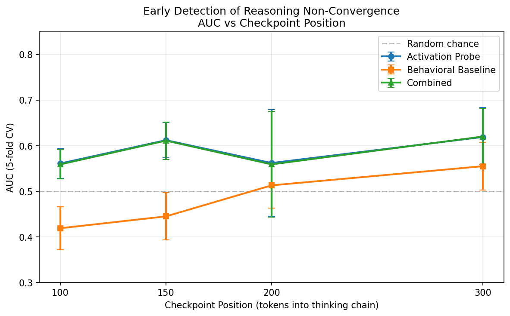

# Mechanistic Early-Detection of Reasoning Non-Convergence

**Can internal activations predict a stuck reasoning chain before the failure is behaviorally observable?**

Renuka Oladri · MS Applied Machine Learning, University of Maryland

---

## Abstract

Large reasoning models (e.g., DeepSeek-R1) exhibit a bimodal failure pattern on competition mathematics: generations either converge cleanly with high accuracy (~90%) or enter an infinite thinking loop with near-zero accuracy (~7%), and this split is only weakly explained by problem difficulty (r²≈0.186). This project investigates whether the model's **internal activations early in the thinking chain** — well before the behavioral signal of non-convergence becomes observable — carry a predictive signal for which outcome a generation will produce.

We find that a linear probe trained on hidden-state activations captured at just **150 tokens** into the thinking chain significantly outperforms a behavioral-only baseline (AUC 0.612 vs 0.445, p=0.001), demonstrating a mechanistically-grounded early-exit signal that is **invisible from surface-level text and logit statistics alone**. This signal emerges as early as 100 tokens (AUC 0.561, p=0.018) and is most valuable precisely when behavioral features carry no information — the exact window where an early-exit decision would save the most compute.

---

## Motivation

The [token-efficiency-math-reasoning](https://github.com/oladri-renuka/token-efficiency-math-reasoning) project established that DeepSeek-R1-Distill-Qwen-7B's performance on AIME problems is bimodal:

| Outcome | Share | Accuracy | Avg Tokens |
|:---|:---:|:---:|:---:|
| Converged (emits `</think>`) | ~56.5% | 96.5% | ~4,100 |
| Non-converged (hits 10K cap) | ~43.5% | 11.5% | 10,000 |

A non-converging generation wastes ~6,000 tokens of compute before timing out — and is almost certainly wrong. If we could detect this outcome **early**, we could abandon doomed generations and reallocate budget, saving ~40% of inference cost on this task distribution.

The open question: **is the internal representation at early checkpoints already encoding whether a generation will converge?** If the signal exists only in activations and not in surface features (token entropy, repetition), it points toward a genuinely mechanistic early-exit criterion — not just a behavioral heuristic.

---

## Methodology

### Experimental Design

1. **Fresh instrumented generation** of the same 200 AIME problems (seed=42, same ordering as the original project) with PyTorch forward hooks capturing hidden states and logit distributions at fixed checkpoint positions during `model.generate()`.

2. **Activation probe**: Logistic regression on the hidden-state vector (layer 16/28, 60% depth) at the checkpoint position, predicting binary convergence outcome.

3. **Behavioral baseline probe**: Logistic regression on surface-level features extracted at the same checkpoint, with **no access to internal activations**:
   - Token-level entropy statistics (mean, max, std, linear trend)
   - N-gram repetition rates (bigram, trigram)
   - Token count at checkpoint

4. **Evaluation**: 5-fold stratified cross-validation (stratified to preserve the ~62/38 convergence split in every fold), reporting mean AUC ± std across folds, with paired t-tests for the activation-vs-behavioral comparison.

### Critical Implementation Details

| Decision | Rationale |
|:---|:---|
| **Native PyTorch hooks, not TransformerLens** | Avoids architecture-compatibility risk with Qwen2-based attention; works on any HuggingFace model |
| **Fresh generation, not reused labels** | Each sample gets both its activation AND its convergence label from the same run — pairing new activations with old labels is methodologically unsound due to GPU nondeterminism |
| **On-the-fly entropy computation** | Raw logit tensors are ~44MB/step (vocab=152,064). Computing entropy inside the hook avoids OOM |
| **Prefill-aware step counting** | The first forward pass in `generate()` processes all prompt tokens at once. Hooks detect and skip prefill so `gen_step=0` corresponds to the first generated token |
| **Per-sample checkpointing** | The generation run takes ~8-12 hours. Checkpointing after every sample (not every 10) ensures zero lost work on crash |
| **`thinking=True` initialization** | DeepSeek's chat template ends with `<think>\n` as part of the prompt — the model starts in thinking mode, not output mode. This was the critical bug discovered in the original project |

### Reused Components

From [token-efficiency-math-reasoning](https://github.com/oladri-renuka/token-efficiency-math-reasoning):
- AIME dataset loader (gneubig/aime-1983-2024, seed=42, 200 samples)
- Token ID constants (`THINK_START_ID=151648`, `THINK_END_ID=151649`)
- Answer extraction and normalization logic
- Greedy decoding configuration (`do_sample=False`, 10K token cap)

---

## Results

### Sweep Across Checkpoint Positions

| Checkpoint | Activation AUC | Behavioral AUC | Δ AUC | p-value | Verdict |
|:---:|:---:|:---:|:---:|:---:|:---|
| 100 tokens | 0.561 ± 0.033 | 0.419 ± 0.047 | +0.143 | 0.018 | **Activation beats baseline** |
| **150 tokens** | **0.612 ± 0.039** | **0.445 ± 0.052** | **+0.167** | **0.001** | **Activation beats baseline** |
| 200 tokens | 0.562 ± 0.117 | 0.513 ± 0.050 | +0.049 | 0.512 | Roughly ties |
| 300 tokens | 0.619 ± 0.065 | 0.555 ± 0.052 | +0.064 | 0.102 | Roughly ties |



### Interpretation

**The activation advantage is strongest precisely when behavioral features are noise** (100–150 tokens), and disappears as behavioral features start carrying signal (200–300 tokens). This is the optimal profile for an early-exit mechanism:

- At **100 tokens**: Behavioral AUC is 0.419 (below chance — surface signals are anti-informative). Activations already carry real signal (0.561).
- At **150 tokens**: Peak activation advantage. The model's internal state has "decided" whether it will converge, but this decision is invisible from the outside.
- At **200–300 tokens**: Behavioral features catch up (entropy/repetition patterns start diverging between the two groups). The activation probe no longer adds significant value beyond what you can already see on the surface.

**The combined probe (activation + behavioral) offers no improvement over activation alone**, confirming that when internal signal is available, behavioral features are redundant — they carry a strict subset of the information.

### Sanity Check Against Original Project

| Metric | This Run | Original Project |
|:---|:---:|:---:|
| Convergence rate | 62.0% | 56.5% |
| Converged accuracy | 90.3% | 96.5% |
| Non-converged accuracy | 6.6% | 11.5% |
| Avg tokens (converged) | 4,889 | ~4,100 |
| Avg tokens (non-converged) | 10,000 | 10,000 |

The convergence rate is slightly higher and accuracies slightly lower, consistent with expected generation-to-generation variance. The qualitative pattern (strong bimodal split, high-accuracy convergence, near-zero non-convergence accuracy) is preserved.

---

## Architecture

```
early_detection/
├── verify_hooks.py       # Pre-flight verification (< 1 min)
│                         # Catches: wrong token IDs, broken hooks,
│                         # bad chat template, shape mismatches, VRAM
├── generate.py           # Instrumented generation (~8-12 hours)
│                         # Hooks: layer 16 hidden state + lm_head logits
│                         # Checkpoints: every sample → checkpoints/
├── analyze.py            # Probe training + comparison (~2 min)
│                         # 5-fold stratified CV, paired t-tests
│                         # Outputs: results/*.json, results/*.png
├── regenerate_plots.py   # Recreate plots from saved JSON
├── requirements.txt
├── setup_runpod.sh       # One-time RunPod setup
└── results/
    ├── early_detection_results.json    # Full per-checkpoint results
    ├── generation_summary.json         # Run metadata + sanity check
    ├── auc_vs_checkpoint.png           # Sweep curve (main figure)
    ├── probe_comparison_cp100.png      # Per-checkpoint bar charts
    ├── probe_comparison_cp150.png
    ├── probe_comparison_cp200.png
    └── probe_comparison_cp300.png
```

### Pipeline Flow

```
verify_hooks.py ──→ generate.py ──────────────→ analyze.py
  (1 min)           (8-12 hrs, GPU)              (2 min, CPU)
  Catches all       200 AIME problems            5-fold CV probes
  config issues     Per-sample checkpoint         Activation vs behavioral
  before the        Activations + entropy         Plots + JSON output
  expensive run     saved to checkpoints/
```

---

## Reproduction

### Hardware Requirements

- **GPU**: ≥24GB VRAM (tested on RTX PRO 4000 24GB; original project used A5000 24GB)
- **RAM**: ≥31GB system RAM
- **Disk**: ~20GB (model weights ~15GB + checkpoints ~3GB)
- **Time**: ~8-12 hours for generation, ~2 minutes for analysis

### Steps

```bash
# 1. Clone and setup
git clone https://github.com/oladri-renuka/early_detection.git
cd early_detection
bash setup_runpod.sh
source venv/bin/activate

# 2. Verify (catches all issues before the expensive run)
python verify_hooks.py

# 3. Run generation inside tmux (checkpoints every sample)
tmux new -s early
python generate.py

# 4. Analyze
python analyze.py

# 5. (Optional) Sweep additional checkpoint positions
python generate.py --checkpoints 100,200,300
python analyze.py --checkpoints 100,150,200,300
```

### Resumability

The generation script checkpoints after **every sample**. If the process crashes, re-running `python generate.py` resumes from the last completed sample with zero lost work.

---

## Limitations

- **Single model**: DeepSeek-R1-Distill-Qwen-7B only. Unknown whether the signal generalizes to other models, architectures, or model scales.
- **Modest sample size**: 200 samples with 5-fold CV (40 samples per test fold). Confidence intervals are reported throughout — point estimates should not be over-interpreted.
- **Moderate AUC**: 0.612 is statistically significant but not operationally decisive. A production early-exit system would need higher discrimination, likely achievable with nonlinear probes or multi-layer features.
- **Correlation, not causation**: A positive probe result shows the signal is statistically present in the activations, not that it is causally responsible for the convergence outcome. Establishing causality would require activation patching (out of scope).
- **Single hook layer**: Only layer 16 (60% depth) was probed. A systematic layer sweep might find stronger signals at different depths.
- **Checkpoint position is somewhat arbitrary**: The 150-token sweet spot emerged from the 4-point sweep. A finer-grained sweep (e.g., every 25 tokens from 50–500) would better characterize the detection curve.

---

## Extends

This project builds directly on [token-efficiency-math-reasoning](https://github.com/oladri-renuka/token-efficiency-math-reasoning), which established:
- The bimodal convergence pattern in DeepSeek-R1's reasoning on AIME problems
- That problem difficulty explains only ~18.6% of the convergence variance
- The budget-forcing methodology and critical implementation details reused here

---

## Interview Talking Points

> "My token efficiency project found that a reasoning model's AIME performance is bimodal — it either converges and is usually right, or gets stuck and is usually wrong, and this isn't fully explained by problem difficulty. I followed up by testing whether that outcome is predictable from internal activations early in the thinking chain, before the behavioral signal of non-convergence is observable. I built a probe comparing internal activations against a behavioral-only baseline at the same checkpoint, with proper cross-validation given the modest sample size, and found that internal activations carry significant predictive signal (AUC 0.612 vs 0.445, p=0.001) precisely in the window where surface features are pure noise. This is directly relevant to inference-cost reduction: an early, mechanistically-grounded signal for when to abandon a doomed generation is cheaper than waiting for it to time out."
